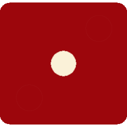

A simple two-player dice game built with HTML, CSS, and JavaScript

# 🎲 Dice Game

A simple two-player dice game built with **HTML, CSS, and JavaScript**.  
Roll two dice, see the winner, and enjoy the interactive design!  

---

## 🚀 How to Play
1. Click the **"Roll Dice"** button.
2. Two dice will roll randomly.
3. The winner is displayed above the dice.
4. Refreshing the page also rolls the dice.

---

## 🖼️ Preview
 <!-- Opsiyonel: kendi screenshot ekleyebilirsin -->

---

## 🌐 Live Demo
   `https://your-username.github.io/dice-game/`

---

## 🎨 Features
- Random dice roll
- Dynamic winner display
- Modern, responsive, and colorful design
- Hover animations on dice
- Click button or refresh to roll

---

## 🛠️ Technologies
- HTML5  
- CSS3  
- JavaScript (ES6)  
- Google Fonts (Poppins)
